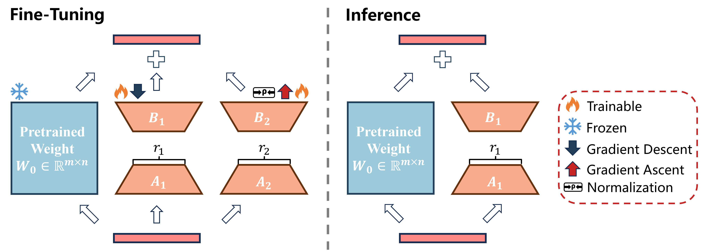

# 📝 Featured Publications

ICLR 2026

[Bi-LoRA: Efficient Sharpness-Aware Minimization for Fine-Tuning Large-Scale Models](https://openreview.net/forum?id=zoYPlgX1bH)

**Yuhang Liu**\*, Tao Li\*, Zhehao Huang, Zuopeng Yang, Xiaolin Huang

[**Code**](https://github.com/CrazyElements/Bi-LoRA)

This paper identifies a key gap in parameter-efficient fine-tuning: LoRA is memory-efficient but can generalize poorly, while a naive LoRA+SAM incurs two-step overhead with perturbations confined to a low-rank subspace, and introduces **Bi-LoRA**, a dual-adapter design that decouples perturbation modeling from task optimization to enable single-backward sharpness-aware training via bi-directional updates with no extra inference cost.

